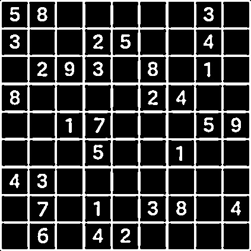

# Capstone Project (Udacity C++ Nanodegree)

An application that can solve a Sudoko puzzle using C++ and the OpenCV library. 

This project aims to implement the concepts learnt during the Udacity C++ course as well as experiment around in the field of image processing and classification. As a starting step, a Sudoku was a nice way to delve in and explore techniques used in recognition of digits as well as learn about backtracing algorithms which can be used to solve the puzzle itself.

## Project Description

The application accepts an image of a Sudoku puzzle, recognize the digits and return the solved puzzle as the output. 

The implementation was therefore broken down into separate logical classes to organize the code accordingly.

The project contains classes for the following tasks
* `ImageProcessor` handles the pre-processing steps needed to identify the Sudoku grid in an image, localise it and extract the Region of Interest for digit recognition. 
* `DigitRecogniser` accepts the processed image with the Sudoku grid to classify the digits and store them in a `vector<vector<int>>`.
* `TrainOCR`, runs for the first time if the trained model is not present. It used Histogram of Oriented Gradients (HoG) and Support Vector Machines (SVM) to train the classifier on the MNIST dataset. 
* `Sudoku` , it contains the logic for solving the puzzle based on backtracking algorithm. It accepts the vector of identified digits and after solving returns a vector of int's as the solution which is printed on the console output.

### Program Flow

`main.cpp` is the main entry point for the application.

* The program checks if the image was specified as the second argument while running the application and raises an error to the user along with usage instructions is not specified.
* The image is then passed to the `ImageProcessor` object to perform some processing operations that identifies the outer grid of the puzzle.
* The objects for the `TrainOCR` & `DigitRecogniser` are created and the processed image is passed as an argument to the `predictDigits()` function of the `DigitRecogniser` class.
* After the classification of the digits, a vector is returned by `DigitRecogniser` class which is then passed on to the `Sudoku` object which calls the `SolveBoard` function to find a solution.
* If a solution exists, it writes the solution on a copy of the image and saves it as well as displays the solution on the console output. Otherwise, prints "Solution not found" on the output.

### Assumptions:
* No perspective or warping corrections needed in this version of the application as the images are digital ones used from the internet. 

## Dependencies for running the project locally:
* cmake >= 3.11.3
  * All OSes: [click here for installation instructions](https://cmake.org/install/)
* make >= 4.1 (Linux, Mac)
  * Linux: make is installed by default on most Linux distros
  * Mac: [install Xcode command line tools to get make](https://developer.apple.com/xcode/features/)
* OpenCV >= 4.1
  * The OpenCV 4.1.0 source code can be found [here](https://github.com/opencv/opencv/tree/4.1.0)
* gcc/g++ >= 5.4
  * Linux: gcc / g++ is installed by default on most Linux distros
  * Mac: same deal as make - [install Xcode command line tools](https://developer.apple.com/xcode/features/)
  * Windows: recommend using [MinGW](http://www.mingw.org/)

## Basic Build Instructions

1. Clone this repository
2. Create a folder named `build` in the top level directory: `mkdir build && cd build`
3. Compiling the application:
 `cmake .. && make`
4. Running the application: 
	`./sudoko <path_to_the_sudoku_image>`
	Example:  `./sudoku ../images/sudoku.jpeg`

## Udacity Capstone Project Requirements – Rubric Points Addressed

A short description of how and where the project requirements are fulfilled.

### 1. README (All Rubric Points REQUIRED)
* A README with instructions is included with the project
  * Yes: README.md file included into the project root folder.
* The README indicates which project is chosen
  * Yes: see section "Project Description" in the README.md file.
* The README includes information about each rubric point addressed
  * Yes.

### 2. Compiling and Testing (All Rubric Points REQUIRED)
* The submission must compile and run
  * Yes.

### 3. Loops, Functions, I/O
* The project demonstrates an understanding of C++ functions and control structures
  * Yes.
* The project reads data from a file and process the data, or the program writes data to a file
  * Yes, it accepts an image as input, processes it further and when solution is calculated, stores the results as `results/ProcessedImage.png` and `results/ReprojectedImage.png`
* The project accepts user input and processes the input
  * Yes. The user must provide the path to the image of the Sudoku puzzle as an argument.

### 4. Object Oriented Programming
* The project uses Object Oriented Programming techniques
  * Yes. The project is organized in 4 different classes namely `ImageProcessor`, `DigitRecogniser`, `TrainOCR`, `Sudoku`. The short description of the purpose of these classes have been described in the project description section.
* Classes use appropriate access specifiers for class members
  * Yes. As per the purpose of the member and/or functions, getters or setters have been implemented.
* Class constructors utilize member initialization lists
  * Yes. 
* Classes abstract implementation details from their interfaces
  * Yes.
* Classes encapsulate behavior
  * Yes. 
* Classes follow an appropriate inheritance hierarchy
  * No, inheritance has not been used.
* Overloaded functions allow the same function to operate on different parameters
  * Yes.
* Derived class functions override virtual base class functions
  * No.
* Templates generalize functions in the project
  * No.

### 5. Memory Management

* The project makes use of references in function declarations
  * Yes. In most places as the image is loaded as a `cv::Mat` function, they have been passed around as references.
* The project uses destructors appropriately
  * Yes.
* The project uses scope / Resource Acquisition Is Initialization (RAII) where appropriate
  * Yes.
* The project follows the Rule of 5
  * No, not implemented.
* The project uses move semantics to move data, instead of copying it, where possible
  * No.
* The project uses smart pointers instead of raw pointers
  * Yes, smart pointers are used as well as raw pointers.

### 6. Concurrency
* The project uses multi-threading
  * No.
* A promise and future is used in the project
  * No.
* A mutex or lock is used in the project
  * No.
* A condition variable is used in the project
  * No.

## Acknowledgements

As mentioned earlier, one of the goals was also to learn about the implementation of an image classifier. Hence, the `TrainOCR` class and some parts of the `DigitRecogniser` class have therefore been adapted from the OpenCV tutorial on recognising handwritten digits trained on the MNIST dataset. The link for this tutorial can be found [here](https://www.learnopencv.com/handwritten-digits-classification-an-opencv-c-python-tutorial/). The code has been taken largely as is and the acknowledgements have also been mentioned in the source and header files accordingly.

## Known Issues

The current version of the application meets the goals of the capstone project and some fine-tuning to address these issues will be done in future.

1. The classifier sometimes wrongly classifies the digits. 
	It may happen due to the font or resolution of the image. The images used have digital digits and the classifier is trained on the handwritten digits classifier. 
2. Misclassification of blank spaces
	The blank spaces are trained to be classified as number 10. Sometimes if the blank spaces contain some stray pixels, it tends to predict a digit, which causes wrongly detected puzzle and leads to no solution

## Future Extensions
1. Improve the classification part of the application to get accurate predictions.
2. Extend the project for real-time solution using a camera/video stream.
4. Convert it into a working Android application that can solve the puzzle and display the solution as an overlay on top of the image.

